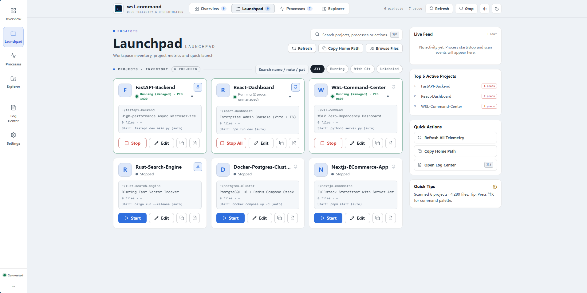
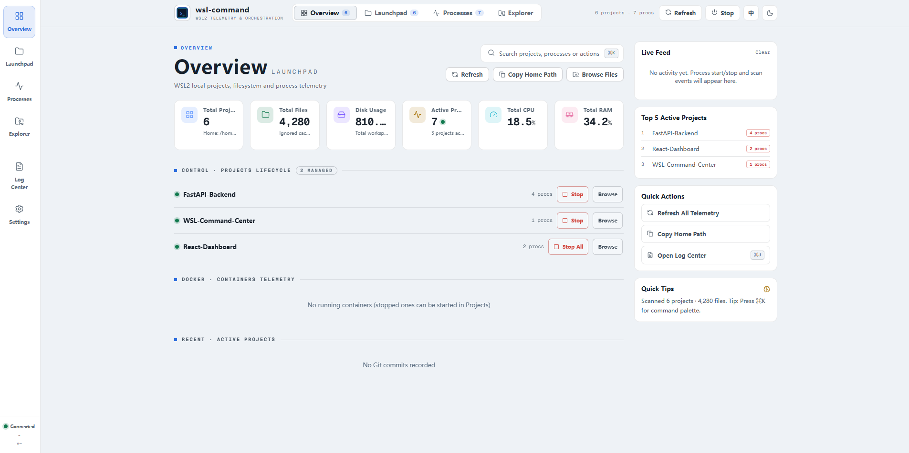

# WSL 指挥中心 · WSL Command

<p align="center">
  <a href="README.md">English</a> •
  <a href="README_zh.md">中文说明</a>
</p>

<p align="center">
  <strong>专为 Windows WSL2 开发者打造的超轻量、零依赖本地工作区控制台与进程编排中心。</strong>
</p>

<p align="center">
  <a href="https://github.com/kongaiyi917-source/wsl-command/actions/workflows/ci.yml"></a>
  <a href="https://github.com/kongaiyi917-source/wsl-command/releases"></a>
  
  
  
  
</p>

<p align="center">
  
</p>

<p align="center">
  
</p>

---

## 🇨🇳 项目简介

**WSL 指挥中心** 是一款专为 Windows WSL2 开发者打造的超轻量、零依赖本地工作区控制台。告别混乱的终端后台、不知道谁在占用的端口和散落在家目录里的项目文件夹。

打开浏览器页面，即刻掌握 WSL2 内的一切运行状态。

### ✨ 核心功能

- 📊 **实时概览**：项目总数、文件数、磁盘空间、运行中进程、CPU 与内存实时负载曲线。
- 📁 **项目中心 & 快捷置顶**：自动扫描家目录项目，智能识别启动命令（`npm start`、`python3`、`start.sh`、`docker-compose` 等），支持项目备注与**卡片置顶**（运行状态绝对优先，同状态内置顶靠前）。
- ⚙️ **进程管理**：实时列出所有进程（含 root 与 Docker 容器进程），按所属项目智能归类，支持多维过滤与排序。
- ▶️ **一键启停**：单个项目或全量进程一键启动/停止，自带二次确认与加载态保护，防止误杀。
- 🐳 **Docker 容器总览**：一览全部容器状态、映射端口与归属项目，支持一键启停。
- 📂 **文件浏览 & 路径互转**：目录树折叠浏览、文本即时预览、隐藏文件显隐切换，一键复制 Linux 路径与 Windows 访问路径（`\\wsl.localhost\...`）。
- 🌐 **中英文一键切换 (i18n)**：全量界面支持 English / 中文无缝切换，自动识别系统语言。
- 🎨 **三态主题 & 快捷键**：深色 / 浅色 / 跟随系统，支持 `⌘K` / `Ctrl+K` 全键盘操作。

### ⚡ 快速开始

无需 `pip install`，无需 `npm build`，极速秒开。

```bash
# 1. 克隆至 WSL2 家目录
git clone https://github.com/kongaiyi917-source/wsl-command.git ~/wsl-command

# 2. 运行服务端（仅需 Python 3.10+，零第三方依赖）
cd ~/wsl-command
python3 server.py
```

在浏览器打开 **http://localhost:9600** 即可体验。

### 🛠️ 技术架构

| 模块 | 技术选型 |
|---|---|
| **后端** | Python 3.10+ 标准库（`http.server`, `subprocess`, `os`），仅绑定本地 `127.0.0.1` |
| **前端** | 原生 ES Modules、CSS 原生变量、内嵌 SVG 图标子集（无任何 npm 依赖，无 CDN，完全离线运行） |
| **配置** | 配置文件存放在 `~/.config/wsl-command/config.json`，运行日志位于 `logs/` |

### 🔒 安全边界

- **仅限本地访问**：仅绑定回环地址 `127.0.0.1`。未开启鉴权前请勿直接映射或反向代理至公网。
- **防止路径遍历**：文件与目录接口严格限制在 `$HOME` 范围内，所有输入均经过 `realpath` 白名单校验。
- **进程安全隔离**：进程停止基于进程组 Token 与 PID 白名单，避免误杀无关的系统任务。

### 📄 开源许可证

本项目基于 [MIT License](LICENSE) 开源。
